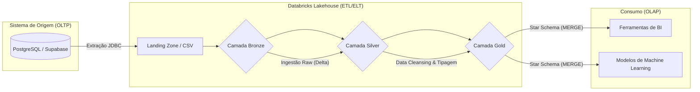

# Data Lakehouse: Pipeline de Engenharia de Dados para o Setor de Seguros


Este repositório documenta a implementação de um ecossistema de dados baseado no paradigma **Data Lakehouse**, utilizando a **Arquitetura Medalhão** (Medallion Architecture). O projeto foi desenvolvido como requisito de avaliação para a disciplina de Engenharia de Dados (Trabalho 3), simulando o fluxo de dados operacionais de uma Seguradora de Veículos.

---

## 1. Visão Geral e Contexto de Negócio

Organizações do setor de seguros lidam com um volume crescente de dados heterogêneos originados de seus sistemas operacionais transacionais (OLTP). Estes dados incluem o registro contínuo de novos clientes, emissão de apólices e a notificação de sinistros.

O desafio central que motivou a construção desta arquitetura é a ineficiência de realizar consultas analíticas complexas diretamente no banco de dados operacional. A plataforma foi arquitetada para solucionar este gargalo através dos seguintes objetivos:
1. **Desacoplamento Analítico:** Isolar a carga de trabalho de leitura analítica da escrita transacional.
2. **Centralização:** Consolidar informações de 11 tabelas relacionais em um repositório unificado.
3. **Governança:** Implementar rotinas automatizadas de *Data Cleansing*.
4. **Disponibilidade para Decisão:** Entregar os dados em um modelo dimensional (*Star Schema*).

---

## 2. Arquitetura do Sistema

A arquitetura lógica do projeto organiza o fluxo de dados em camadas progressivas para garantir governança, rastreabilidade e qualidade.

### 2.1. Diagrama de Fluxo de Dados



### 2.2. Detalhamento das Camadas
1. **Landing Zone:** Atua como buffer de ingestão. Os dados são extraídos do Supabase via conexão JDBC e gravados em Volumes nativos do Databricks no formato original (`.csv`), desacoplando a carga analítica do banco transacional.
2. **Camada Bronze (Raw):** Realiza a leitura dos arquivos CSV e converte para o formato Delta Lake. Esta camada é *append-only*, mantendo o histórico fiel à origem e permitindo reprocessamentos futuros sem necessidade de nova extração.
3. **Camada Silver (Cleansed):** Camada de consolidação e qualidade de dados (*Data Quality*). Aplica rotinas de normalização de strings (UPPER, TRIM), padronização de documentos (CPFs), tratamento de valores nulos e tipagem rigorosa de dados.
4. **Camada Gold (Curated):** Camada analítica final. Transforma as tabelas normalizadas da Silver em um modelo dimensional (*Star Schema*), utilizando rotinas de `MERGE` (Upsert) para garantir atualização incremental de fatos e dimensões sem duplicidade.

---

## 3. Modelagem e Dicionário de Dados

O projeto realiza a transição de um modelo relacional normalizado (3NF) para um modelo dimensional otimizado para leitura e agregações complexas.

### 3.1. Origem: Modelo Relacional
A base de dados transacional fonte é composta por 11 entidades relacionais: `regiao`, `estado`, `municipio`, `marca`, `modelo`, `carro`, `cliente`, `apolice`, `sinistro`, `endereco` e `telefone`.

### 3.2. Destino: Camada Gold (Star Schema)
Os dados foram desnormalizados e consolidados em Tabelas Fato e Tabelas Dimensão, adotando Chaves Substitutas (*Surrogate Keys - SK*) geradas via Databricks.

#### Tabela Fato: `fato_sinistro`
Grava a ocorrência de cada evento registrado pela seguradora.

| Coluna | Tipo SQL | Chave | Descrição |
| :--- | :--- | :--- | :--- |
| `SK_TEMPO` | BIGINT | FK | Chave estrangeira para a data do sinistro. |
| `SK_CLIENTE` | BIGINT | FK | Chave estrangeira para o titular da apólice. |
| `SK_CARRO` | BIGINT | FK | Chave estrangeira para o veículo envolvido. |
| `SK_LOCALIDADE` | BIGINT | FK | Chave estrangeira para o local de ocorrência. |
| `QUANTIDADE` | INT | - | Métrica unitária de agregação de volume (Valor default = 1). |

#### Tabelas Dimensão
Fornecem os atributos descritivos para agrupamento e filtragem das métricas.

* **dim_cliente:**
  * Colunas: `SK_CLIENTE`, `CODIGO_CLIENTE`, `NOME`, `CPF`, `SEXO`, `DATA_NASCIMENTO`.
  * Objetivo: Análise de perfil demográfico e risco por faixa etária/gênero.
* **dim_carro:**
  * Colunas: `SK_CARRO`, `PLACA`, `MARCA`, `MODELO`, `ANO`, `COR`.
  * Objetivo: Análise de sinistralidade por montadora e características do veículo.
* **dim_localidade:**
  * Colunas: `SK_LOCALIDADE`, `MUNICIPIO`, `ESTADO`, `REGIAO`.
  * Objetivo: Análise geoespacial para precificação regionalizada.
* **dim_tempo:**
  * Colunas: `SK_TEMPO`, `DATA_COMPLETA`, `DIA`, `MES`, `ANO`, `TRIMESTRE`.
  * Objetivo: Análise de sazonalidade e séries temporais estáticas.

---

## 4. Estrutura do Repositório

```text
├── notebooks/                   # Scripts Pyspark/SQL do pipeline ETL
│   ├── 00_preparando_ambiente   # Criação de Catálogos, Schemas e Volumes
│   ├── 001_extracao_landing     # Ingestão via JDBC (Supabase -> CSV)
│   ├── 002_camada_bronze        # Ingestão de CSV para Delta format
│   ├── 003_camada_silver        # Regras de negócio e Data Cleansing
│   ├── 004_camada_gold          # Modelagem dimensional e rotinas MERGE
│   └── 005_destroi_ambiente     # Drop de schemas e reset de ambiente
├── .gitignore                   # Arquivos ignorados pelo Git
└── README.md                    # Documentação principal (Este arquivo)
```

---

## 5. Instruções de Configuração e Execução

Para reproduzir o processamento de dados e validar a arquitetura, siga as diretrizes abaixo.

### 5.1. Pré-requisitos
* Conta ativa no Databricks Community Edition.
* Cluster configurado com suporte nativo a Apache Spark (Python/SQL).
* Credenciais de acesso de leitura à base PostgreSQL de origem (Supabase).

### 5.2. Execução do Pipeline de Dados (Databricks)
1. **Clonagem:** Importe este repositório para o seu Workspace utilizando a funcionalidade **Databricks Repos / Git Folders**.
2. **Gestão de Credenciais:** Por diretrizes de segurança, a senha do banco transacional não está parametrizada no código-fonte. Ao iniciar a execução do notebook `001_extracao_landing`, utilize o Widget (caixa de input) gerado no topo da interface para inserir a senha do banco.
3. **Ordem de Execução:** O pipeline possui forte dependência hierárquica. Execute os scripts sequencialmente na exata ordem numérica listada na pasta `notebooks`:
   * `00_preparando_ambiente.py`
   * `001_extracao_landing.py`
   * `002_camada_bronze.py`
   * `003_camada_silver.py`
   * `004_camada_gold.py`

*(Caso necessite reexecutar o projeto do zero, rode o notebook utilitário `005_destroi_ambiente.py` para limpar os dados).*

---

## 6. Referências e Links Úteis

* [Documentação Oficial do Databricks](https://docs.databricks.com/)
* [Arquitetura Medalhão (Medallion Architecture)](https://www.databricks.com/glossary/medallion-architecture)
* [Delta Lake Documentation](https://docs.delta.io/latest/index.html)
* [Apache Spark SQL, Built-in Functions](https://spark.apache.org/docs/latest/api/sql/index.html)
* [Supabase Database Documentation](https://supabase.com/docs/guides/database)
* [Modelagem Dimensional e Star Schema (Kimball)](https://www.kimballgroup.com/data-warehouse-business-intelligence-resources/kimball-techniques/dimensional-modeling-techniques/)

