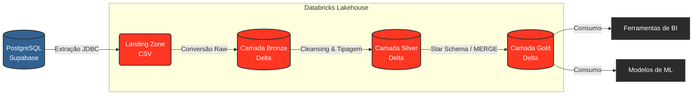

# Data Lakehouse: Pipeline de Engenharia de Dados para o Setor de Seguros

[](https://www.python.org/downloads/)
[](https://spark.apache.org/)
[](https://www.databricks.com/)
[](https://www.postgresql.org/)

Este repositório documenta a implementação de um ecossistema de dados baseado no paradigma **Data Lakehouse**, utilizando a **Arquitetura Medalhão** (Medallion Architecture). O projeto foi desenvolvido como requisito de avaliação para a disciplina de Engenharia de Dados, simulando o fluxo de processamento de dados operacionais de uma Seguradora de Veículos.

---

## 1. Visão Geral e Contexto de Negócio

Organizações do setor de seguros lidam com um volume crescente de dados heterogêneos originados de seus sistemas operacionais transacionais (OLTP). Estes dados incluem o registro contínuo de novos clientes, emissão de apólices e a notificação de sinistros.

O desafio central que motivou a construção desta arquitetura é a ineficiência e o risco de realizar consultas analíticas complexas diretamente no banco de dados operacional. A plataforma foi desenhada para solucionar este gargalo através dos seguintes objetivos primários:

1. **Desacoplamento Analítico:** Isolar a carga de trabalho de leitura analítica (OLAP) da escrita transacional (OLTP).
2. **Centralização:** Consolidar informações de 11 tabelas relacionais em um repositório unificado e escalável.
3. **Governança e Qualidade:** Implementar rotinas automatizadas de *Data Cleansing* e padronização.
4. **Disponibilidade para Apoio à Decisão:** Entregar os dados em um modelo dimensional (*Star Schema*) otimizado para consumo.

---

## 2. Arquitetura do Sistema

A arquitetura lógica do projeto organiza o fluxo de dados em camadas progressivas de refinamento para garantir governança, rastreabilidade e performance.

### 2.1. Diagrama de Fluxo de Dados



### 2.2. Detalhamento das Camadas

* **Landing Zone:** Atua como buffer de ingestão. Os dados são extraídos do Supabase via conexão JDBC e gravados em Volumes nativos do Databricks no formato original (`.csv`), desacoplando a carga inicial do banco transacional.
* **Camada Bronze (Raw):** Realiza a leitura dos arquivos CSV e os converte para o formato Delta Lake. Esta camada é estruturada como *append-only*, mantendo o histórico fiel à origem e permitindo reprocessamentos futuros sem a necessidade de novas requisições ao sistema OLTP.
* **Camada Silver (Cleansed):** Camada de consolidação e qualidade de dados (*Data Quality*). Aplica rotinas de normalização de strings (UPPER, TRIM), padronização de documentos (CPFs), tratamento de valores nulos e tipagem rigorosa de colunas.
* **Camada Gold (Curated):** Camada analítica final. Transforma as tabelas normalizadas da Silver em um modelo dimensional otimizado. Utiliza rotinas de `MERGE` (Upsert) para garantir a atualização incremental de fatos e dimensões, evitando duplicidade de registros.

---

## 3. Modelagem e Dicionário de Dados

O projeto realiza a transição de um modelo relacional altamente normalizado (3NF) para um modelo dimensional focado em leitura rápida e agregações complexas.

### 3.1. Origem (Modelo Relacional)
A base de dados transacional fonte é composta por 11 entidades: `regiao`, `estado`, `municipio`, `marca`, `modelo`, `carro`, `cliente`, `apolice`, `sinistro`, `endereco` e `telefone`.

### 3.2. Destino: Camada Gold (Star Schema)
Os dados foram desnormalizados e consolidados adotando Chaves Substitutas (*Surrogate Keys - SK*) geradas monotonicamente no Databricks.

#### Tabela Fato: `fato_sinistro`
Armazena a ocorrência e as métricas de cada evento registrado pela seguradora.

| Coluna | Tipo SQL | Chave | Descrição |
| :--- | :--- | :--- | :--- |
| `SK_TEMPO` | BIGINT | FK | Chave estrangeira referenciando a data do sinistro. |
| `SK_CLIENTE` | BIGINT | FK | Chave estrangeira referenciando o titular da apólice. |
| `SK_CARRO` | BIGINT | FK | Chave estrangeira referenciando o veículo envolvido. |
| `SK_LOCALIDADE` | BIGINT | FK | Chave estrangeira referenciando o local da ocorrência. |
| `QUANTIDADE` | INT | - | Métrica unitária para agregação de volume (Default = 1). |

#### Tabelas Dimensão
Fornecem os atributos descritivos e contextuais para o agrupamento e filtragem da tabela fato.

* **dim_cliente:**
  * **Colunas:** `SK_CLIENTE`, `CODIGO_CLIENTE`, `NOME`, `CPF`, `SEXO`, `DATA_NASCIMENTO`.
  * **Objetivo:** Análise de perfil demográfico e risco por faixa etária ou gênero.
* **dim_carro:**
  * **Colunas:** `SK_CARRO`, `PLACA`, `MARCA`, `MODELO`, `ANO`, `COR`.
  * **Objetivo:** Análise de sinistralidade cruzada por montadora e características físicas do veículo.
* **dim_localidade:**
  * **Colunas:** `SK_LOCALIDADE`, `MUNICIPIO`, `ESTADO`, `REGIAO`.
  * **Objetivo:** Análise geoespacial para precificação regionalizada e mapeamento de risco de rotas.
* **dim_tempo:**
  * **Colunas:** `SK_TEMPO`, `DATA_COMPLETA`, `DIA`, `MES`, `ANO`, `TRIMESTRE`.
  * **Objetivo:** Análise de sazonalidade e projeções de séries temporais.

---

## 4. Estrutura do Repositório

```text
├── notebooks/                   # Scripts PySpark/SQL do pipeline ETL
│   ├── 00_preparando_ambiente   # Criação de Catálogos, Schemas e Volumes
│   ├── 001_extracao_landing     # Ingestão via JDBC (Supabase -> CSV)
│   ├── 002_camada_bronze        # Conversão de CSV para formato Delta
│   ├── 003_camada_silver        # Aplicação de regras de negócio e Data Cleansing
│   ├── 004_camada_gold          # Modelagem dimensional e rotinas MERGE
│   └── 005_destroi_ambiente     # Drop de schemas e reset de ambiente de testes
├── .gitignore                   # Arquivos ignorados pelo controle de versão
└── README.md                    # Documentação principal da arquitetura
```

---

## 5. Instruções de Configuração e Execução

Para reproduzir o processamento de dados e validar a arquitetura em seu próprio ambiente, siga as diretrizes abaixo.

### 5.1. Pré-requisitos
* Conta ativa no Databricks (Community Edition ou corporativa).
* Cluster instanciado com suporte nativo a Apache Spark (Python/SQL) e Delta Lake.
* Credenciais de acesso de leitura à base PostgreSQL de origem (Supabase).

### 5.2. Execução do Pipeline no Databricks
1. **Clonagem do Código:** Importe este repositório para o seu Workspace utilizando a funcionalidade **Databricks Repos / Git Folders**.
2. **Gestão de Credenciais:** Por diretrizes de segurança, a senha do banco transacional não está codificada nos scripts (*hardcoded*). Ao iniciar a execução do notebook `001_extracao_landing`, utilize o Widget (caixa de input de parâmetros) gerado no topo da interface gráfica para inserir a senha de acesso ao banco.
3. **Ordem de Execução:** O pipeline possui forte dependência hierárquica. Os scripts devem ser executados na exata ordem sequencial listada na pasta `notebooks`:
   * `00_preparando_ambiente.py`
   * `001_extracao_landing.py`
   * `002_camada_bronze.py`
   * `003_camada_silver.py`
   * `004_camada_gold.py`

> **Nota Operacional:** Caso necessite reexecutar a simulação do zero ou limpar o armazenamento do cluster, execute o notebook utilitário `005_destroi_ambiente.py` para realizar o drop em cascata dos catálogos e volumes criados.

## 6. Orquestração e Automação (Databricks Workflows / Jobs)

Para garantir que a base de dados analítica esteja sempre atualizada sem intervenção manual, todo o pipeline ETL foi automatizado utilizando o **Databricks Workflows (Jobs)**.

O Job foi configurado para orquestrar a execução sequencial dos notebooks, respeitando rigorosamente a hierarquia de dependências das camadas da Arquitetura Medalhão.

### 5.1. Topologia e Execução do Workflow

Abaixo está a evidência da orquestração configurada na plataforma, garantindo que uma camada só inicie seu processamento se a tarefa anterior for concluída com sucesso.


*Figura 1: Visão do grafo de tarefas (Task Graph) executado com sucesso no Databricks Workflows, evidenciando o encadeamento desde o preparo do ambiente até a consolidação da Camada Gold.*

### 5.2. Detalhes da Configuração do Job
* **Cluster Type:** Serverless (Otimizado para executar cargas de trabalho sob demanda instantaneamente, reduzindo a sobrecarga de gerenciamento de infraestrutura).
* **Agendamento (Schedule):** Configurado para execução regular, garantindo a ingestão contínua de novos sinistros e apólices.
* **Gestão de Falhas:** Em caso de falha em qualquer uma das *Tasks*, o Job interrompe a execução das tarefas subsequentes para evitar a propagação de dados corrompidos ou incompletos para as camadas Silver e Gold.


---

## 7. Referências e Base de Conhecimento

* [Documentação Oficial do Databricks](https://docs.databricks.com/)
* [Arquitetura Medalhão (Medallion Architecture) - Databricks Glossary](https://www.databricks.com/glossary/medallion-architecture)
* [Delta Lake Documentation](https://docs.delta.io/latest/index.html)
* [Apache Spark SQL - Built-in Functions Reference](https://spark.apache.org/docs/latest/api/sql/index.html)
* [Supabase PostgreSQL Database Documentation](https://supabase.com/docs/guides/database)
* [Modelagem Dimensional e Star Schema (Kimball Group)](https://www.kimballgroup.com/data-warehouse-business-intelligence-resources/kimball-techniques/dimensional-modeling-techniques/)
