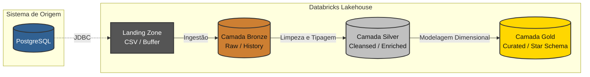

# Arquitetura do Sistema: O Paradigma Medalhão

A arquitetura lógica deste projeto foi estruturada com base na **Medallion Architecture** (Arquitetura Medalhão). Trata-se de um padrão de design de dados amplamente adotado no ecossistema Lakehouse, cujo objetivo primário é melhorar a estrutura e a qualidade dos dados de forma incremental e progressiva à medida que fluem através de camadas de processamento.

!!! abstract "Filosofia da Arquitetura"
    A premissa fundamental da Arquitetura Medalhão é a separação de responsabilidades. Em vez de tentar extrair, limpar e modelar os dados em uma única etapa monolítica (o que dificulta a depuração e a governança), o fluxo é dividido em estágios granulares. Isso garante rastreabilidade total: se uma inconsistência for detectada nos relatórios finais, o engenheiro pode rastrear a linhagem do dado de volta até sua forma original.

---

## 1. Topologia do Pipeline de Dados

O fluxo de Extração, Carga e Transformação (ELT) foi segmentado em quatro estágios sequenciais e interdependentes.

### Diagrama Lógico de Camadas

---

## 2. Detalhamento dos Estágios

### 2.1. Landing Zone (Zona de Pouso)
* **Objetivo:** Realizar a ingestão dos dados brutos do PostgreSQL com o menor impacto de concorrência possível no banco de dados transacional (OLTP).
* **Formato de Armazenamento:** Arquivos `.csv` delimitados (Volumes Nativos do Databricks).
* **Comportamento Lógico:** Atua puramente como um *buffer* temporário. Os dados são extraídos das 11 tabelas transacionais via conexão JDBC e gravados no Lakehouse sem qualquer alteração de esquema, tipagem ou regra de negócio.

!!! tip "Desacoplamento de Carga"
    A utilização de uma Landing Zone baseada em arquivos evita que rotinas analíticas pesadas consultem diretamente o banco de produção, protegendo a performance do sistema da seguradora contra indisponibilidades.

---

### 2.2. Camada Bronze (Raw Data)
* **Objetivo:** Garantir a persistência do histórico e criar uma réplica exata da fonte, migrando os dados para um formato de alto desempenho.
* **Formato de Armazenamento:** Tabelas `Delta`.
* **Comportamento Lógico:** Os dados CSV são lidos em sua forma primitiva e convertidos para o Delta Lake. 

!!! warning "Princípio da Imutabilidade"
    A camada Bronze opera estritamente no modelo *append-only* (apenas inserção). Nenhuma informação original é descartada ou mascarada. Isso garante que, caso as regras de negócio mudem no futuro, possamos reprocessar os dados a partir do histórico fiel contido no Lakehouse, sem precisar requisitar o banco de origem novamente.

---

### 2.3. Camada Silver (Cleansed Data)
* **Objetivo:** Higienização, validação e padronização. Esta camada representa a visão corporativa consolidada (*Enterprise View*).
* **Formato de Armazenamento:** Tabelas `Delta`.
* **Comportamento Lógico:** Aplicação rigorosa de lógicas de qualidade de dados (*Data Quality*). As transformações incluem:
    * **Tipagem:** Conversão sistemática de *strings* para inteiros, *floats* e formatação lógica de datas (`DATE`).
    * **Padronização:** Normalização de textos utilizando funções como `UPPER()` e `TRIM()`, além de formatação de padrões de documentos (CPFs).
    * **Tratamento de Exceções:** Gestão de valores nulos (*Null constraints*) e deduplicação de registros baseada em chaves primárias e *timestamps*.

---

### 2.4. Camada Gold (Curated Data)
* **Objetivo:** Entrega direta de valor para o negócio, focando em alta performance de leitura e suporte à decisão.
* **Formato de Armazenamento:** Tabelas `Delta`.
* **Comportamento Lógico:** Os dados normalizados da camada Silver são cruzados (via `JOINs`) e modelados em um **Esquema Estrela (Star Schema)**, construindo uma arquitetura otimizada para ferramentas de BI e algoritmos de Machine Learning.

!!! success "Atualização Incremental com MERGE"
    Na camada Gold, utilizamos rotinas DML avançadas com a instrução `MERGE` (Upsert). Essa técnica permite gerenciar o ciclo de vida dos dados de forma inteligente: gerencia a inserção fluida de novos clientes e sinistros, ao mesmo tempo que atualiza registros já existentes sem gerar duplicidade de informações nas Tabelas Fato e Dimensão.
