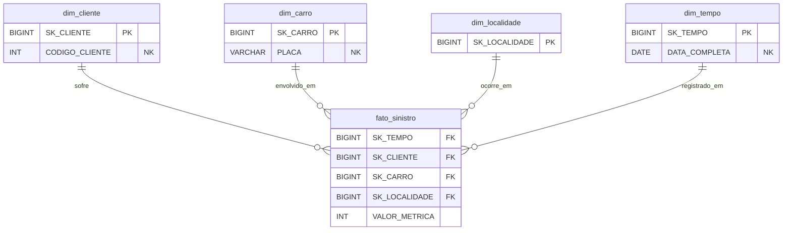

# Modelagem e Dicionário de Dados

A transição arquitetural do sistema de origem (OLTP) para a Camada Gold (OLAP) exige uma reestruturação profunda do esquema de dados. Bancos transacionais são construídos para gravar dados rapidamente, enquanto repositórios analíticos são otimizados para leitura massiva e agregações.

---

## 1. Modelo de Origem (PostgreSQL)

O banco de dados operacional foi desenhado na **3ª Forma Normal (3NF)**.

* **Estrutura:** O esquema fonte é composto por 11 entidades fortemente tipadas e relacionadas: `regiao`, `estado`, `municipio`, `marca`, `modelo`, `carro`, `cliente`, `apolice`, `sinistro`, `endereco` e `telefone`.
* **Objetivo na Origem:** Evitar anomalias de atualização e inserção, além de economizar espaço de armazenamento.

!!! warning "O Gargalo Analítico da 3NF"
    Para responder a uma pergunta de negócio simples, como *"Qual a quantidade de sinistros de carros da marca FIAT no estado de SP no último trimestre?"*, um analista precisaria realizar mais de 6 `JOINs` no banco de dados operacional. Isso degrada a performance e impacta o sistema transacional.

---

## 2. Modelo de Destino: Camada Gold (Star Schema)

Para viabilizar as análises no Databricks, as 11 tabelas originais foram consolidadas e desnormalizadas em **1 Tabela Fato** e **4 Tabelas Dimensão**.

### 2.1. Visão Arquitetural do Star Schema

O diagrama abaixo ilustra a centralização dos eventos (Fato) cercados por seus contextos descritivos (Dimensões):

!!! tip "O Uso de Chaves Substitutas (Surrogate Keys)"
    Em vez de usar as chaves primárias do banco de origem (Natural Keys - `NK`), a Camada Gold adota Chaves Substitutas (`SK`) geradas nativamente pelo Databricks (`GENERATED BY DEFAULT AS IDENTITY`). Isso isola o Lakehouse de mudanças bruscas no sistema de origem (como a reciclagem de um ID) e otimiza a performance dos cruzamentos por utilizar números inteiros sequenciais (BIGINT).

---

## 3. Dicionário de Dados

### 3.1. Tabela Fato: `fato_sinistro`
Grava a ocorrência de cada evento (acidente ou sinistro) registrado pela seguradora, cruzando as dimensões associadas ao evento.

| Nome da Coluna | Tipo | Chave | Descrição |
| :--- | :--- | :--- | :--- |
| `SK_TEMPO` | BIGINT | FK | Chave estrangeira referenciando a data exata da ocorrência na dimensão de tempo. |
| `SK_CLIENTE` | BIGINT | FK | Chave estrangeira referenciando o titular da apólice afetada. |
| `SK_CARRO` | BIGINT | FK | Chave estrangeira referenciando o veículo acidentado. |
| `SK_LOCALIDADE`| BIGINT | FK | Chave estrangeira referenciando o local geográfico da ocorrência. |
| `VALOR_METRICA`| INT | - | Métrica unitária utilizada para contagem e agregação de volume (Default = 1). |

---

### 3.2. Tabela Dimensão: `dim_cliente`
Armazena os atributos demográficos e de identificação dos segurados.

| Nome da Coluna | Tipo | Chave | Descrição |
| :--- | :--- | :--- | :--- |
| `SK_CLIENTE` | BIGINT | PK | Chave primária substituta da dimensão. |
| `CODIGO_CLIENTE`| INT | NK | Chave natural (Business Key) vinda do sistema de origem. |
| `NOME` | VARCHAR(50)| - | Nome completo do cliente padronizado em caixa alta. |
| `CPF` | VARCHAR(14)| - | Documento de identificação padronizado. |
| `SEXO` | CHAR(1) | - | Gênero biológico do segurado ('M' ou 'F'). |
| `DATA_NASCIMENTO`| DATE | - | Data de nascimento para cálculo demográfico e classificação de risco. |

---

### 3.3. Tabela Dimensão: `dim_carro`
Consolida as informações do bem material segurado, desnormalizando a hierarquia de marca e modelo.

| Nome da Coluna | Tipo | Chave | Descrição |
| :--- | :--- | :--- | :--- |
| `SK_CARRO` | BIGINT | PK | Chave primária substituta da dimensão. |
| `PLACA` | VARCHAR(10)| NK | Chave natural de identificação do veículo. |
| `MARCA` | VARCHAR(50)| - | Nome da montadora (Ex: FIAT, VOLKSWAGEN). |
| `MODELO` | VARCHAR(50)| - | Nome do modelo específico (Ex: UNO, GOL). |
| `ANO` | INT | - | Ano de fabricação do veículo. |
| `COR` | VARCHAR(20)| - | Cor predominante registrada do veículo. |

---

### 3.4. Tabela Dimensão: `dim_localidade`
Centraliza a hierarquia geográfica (Município > Estado > Região) para evitar junções excessivas em consultas de mapas de calor.

| Nome da Coluna | Tipo | Chave | Descrição |
| :--- | :--- | :--- | :--- |
| `SK_LOCALIDADE` | BIGINT | PK | Chave primária substituta da dimensão. |
| `MUNICIPIO` | VARCHAR(100)| - | Nome do município de ocorrência. |
| `ESTADO` | VARCHAR(100)| - | Nome do estado correspondente. |
| `REGIAO` | VARCHAR(50)| - | Região geopolítica (SUL, SUDESTE, NORDESTE, etc). |

---

### 3.5. Tabela Dimensão: `dim_tempo`
Dimensão gerada estaticamente para o calendário.

| Nome da Coluna | Tipo | Chave | Descrição |
| :--- | :--- | :--- | :--- |
| `SK_TEMPO` | BIGINT | PK | Chave primária substituta (geralmente no formato numérico YYYYMMDD). |
| `DATA_COMPLETA` | DATE | NK | Data real do calendário no formato padrão. |
| `DIA` | INT | - | Dia numérico extraído da data (1-31). |
| `MES` | INT | - | Mês numérico extraído da data (1-12). |
| `ANO` | INT | - | Ano extraído da data (YYYY). |
| `TRIMESTRE` | INT | - | Trimestre correspondente (1-4). |

!!! abstract "A Importância da Dimensão Tempo"
    Em vez de forçar as ferramentas de BI a utilizarem funções complexas e custosas de manipulação de datas no momento da consulta (`EXTRACT`, `DATE_PART`), a Dimensão Tempo pré-calcula todos os atributos possíveis de calendário (dia, mês, ano, trimestre, dia da semana, feriados). Isso acelera drasticamente a construção de séries históricas e comparações *Year-over-Year* (YoY).
